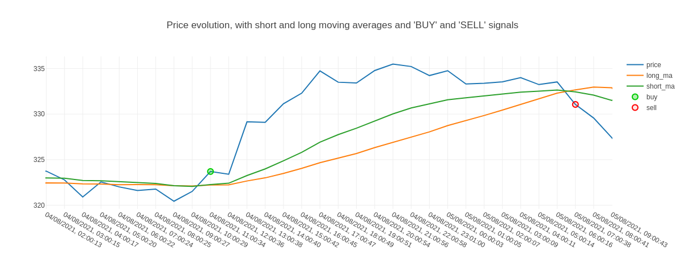

# cryptoBot

Simple bot taking a long SMA and a short EMA to buy and sell any crypto currency using the binance API. Please keep in mind that this is a hobby project, monitor the transactions made by the bot, don't risk too much money and tell me if you find bugs!




## Setup

Install the required dependencies by running:
```pip install -r requirements.txt```

To set the package up, the [binance api keys](https://www.binance.com/en/support/faq/360002502072) are required. The reading and Spot & Margin trading rights are required for this bot, please don't enable any other options such as withdrawals for security reasons.

Once the api keys are known, just run [quick_start.py](./quick_start.py) to set the api keys. They are stored in the [keys.txt](./keys.txt) file. Additionally, the parameters will be set up:
- `asset1` and `asset2`: first and second currency of a pair: for BTCETH, `asset1` is BTC and `asset2` is ETH.
- `interval`: interval at which the bot updates. for one hour, `interval` is `1h`.
- `short_span`: short **exponential** moving average window, so the number of past points that will be used for the rolling average (max: 500)
- `long_span`: long **simple** moving average window, so the number of past points that will be used for the rolling average (max: 500)
- `database`: boolean, True if you want to make a database to keep track, false if not. The database will look like [this](http://sulpizio.net/tradeHistory) with the possibility to keep track like [this](http://sulpizio.net/price_plot).

The setup will therefore look somewhat like this:

```API keys not set up,
Please enter public Binance api key:
{API PUBLIC KEY HERE}
Please enter secret Binance api key:
{API SECRET KEY HERE}
Done!
Creating Settings:
Please enter the first symbol of the traded pair (in BTCUSDT, this would be BTC):
btc
Please enter the second symbol of the traded pair (in BTCUSDT, this would be USDT):
eth
Please type in a custom interval, chosen from:  1m, 3m, 5m, 15m, 30m, 1h, 2h, 4h, 6h, 8h, 12h, 1d, 3d
15m
Please enter (in interval units) the short exponential moving average window:
30
Please enter (in interval units) the long simple moving average window
50
Please choose if you want to record the price, the averages, the available balance and any action in a database (enter True or False)
True
Done!
```

In order to get notifications when trades are executed, it is possible to set up your own [notify.run](https://notify.run/) server. No changes are needed other than set up the server. 

## Modifying settings


To modify settings such as the interval or the traded pair, run [modify_settings.py](./modify_settings.py) and simply navigate the menu.

# [Documentation](https://gsulpizio.github.io/cryptoBot)
